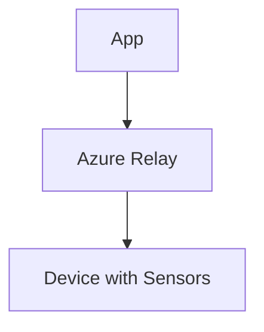
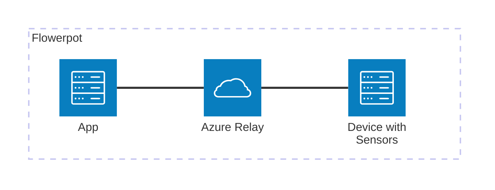

# Flowerpot

```mermaid
graph TD
    A[App] --> AR[Azure Relay] --> D[Device with Sensors]
```

### Architecture

```mermaid
architecture-beta
    group flowerpot[Flowerpot]

    service app(server)[App] in flowerpot
    service azure_relay(cloud)[Azure Relay] in flowerpot
    service device(server)[Device with Sensors] in flowerpot

    app:R -- L:azure_relay
    azure_relay:R -- L:device
```

### Circuit