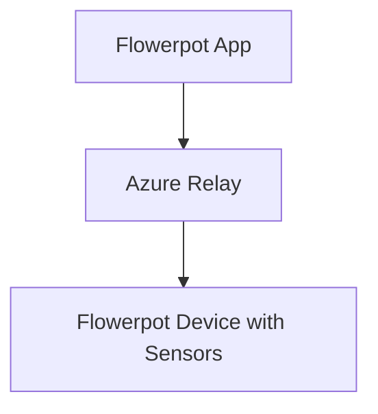
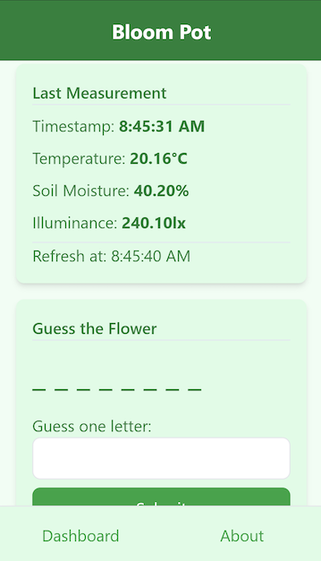
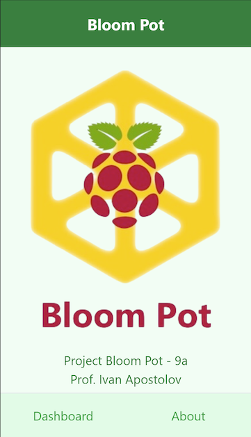

# Flowerpot (later rebranded Project Bloom Pot)


Project Bloom Pot - 9a, 2025

Prof. Ivan Apostolov

English Language School

#### Structure



### Circuit

### App

Dashboard view



About view



### Service

#### Status

```shell
sudo systemctl status Flowerpot

sudo journalctl -u Flowerpot -f
```

#### Deployment

```shell
sudo systemctl stop Flowerpot

dotnet publish Device.Host -c Release -o /usr/local/Flowerpot

cp Device.Host/appsettings.* /usr/local/Flowerpot

sudo cp Flowerpot.service /etc/systemd/system/Flowerpot.service

sudo systemctl daemon-reload

sudo systemctl start Flowerpot
```

### Docker

#### Deployment

```shell
dotnet publish --os linux --arch arm /t:PublishContainer

docker run -d --restart unless-stopped flowerpot
```
