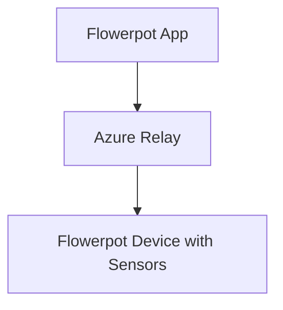
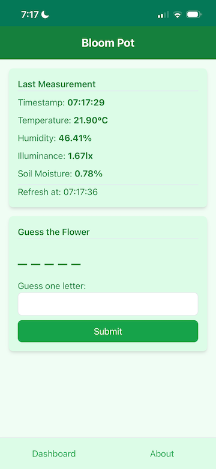
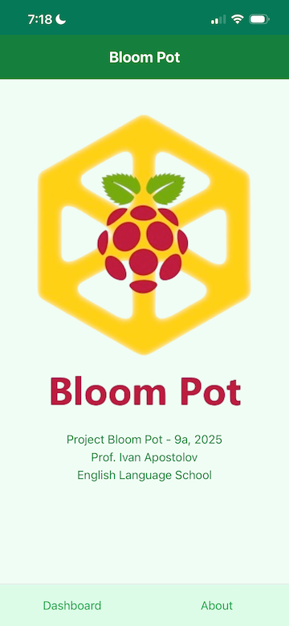
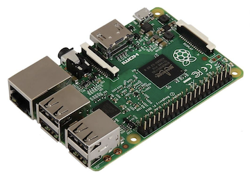
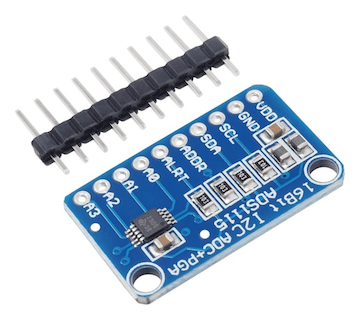
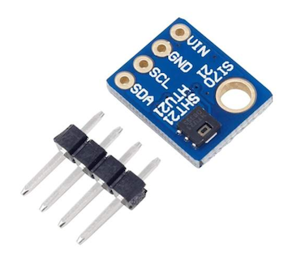
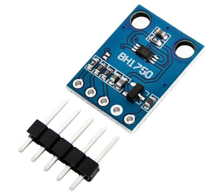
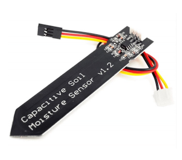
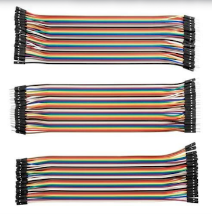

# Flowerpot (later rebranded Project Bloom Pot)


Project Bloom Pot - 9a, 2025

Prof. Ivan Apostolov

English Language School

#### Structure



### App

#### Dashboard View



#### About View



### Device Bill of Materials

| Image | Role | Name |
|-------|------|------|
|  | Single-Board Computer (SBC) | Raspberry Pi 2 Model B |
|  | Analog to Digital Converter (ADC) | ADC1115 |
|  | Temperature and Humidity Sensor | SHT21, HTU21 |
|  | Illuminance Sensor | BH1750 |
|  | Soil Moisture Sensor | Capacitive Soil Moisture Sensor v1.2 |
|  | Jumper Wires |  |

### Deployment

#### Service

```shell
sudo systemctl status Flowerpot

sudo journalctl -u Flowerpot -f

sudo systemctl stop Flowerpot

dotnet publish Device.Host -c Release -o /usr/local/Flowerpot

cp Device.Host/appsettings.* /usr/local/Flowerpot

sudo cp Flowerpot.service /etc/systemd/system/Flowerpot.service

sudo systemctl daemon-reload

sudo systemctl start Flowerpot
```

#### Docker

```shell
dotnet publish --os linux --arch arm /t:PublishContainer

docker run -d --restart unless-stopped flowerpot
```
